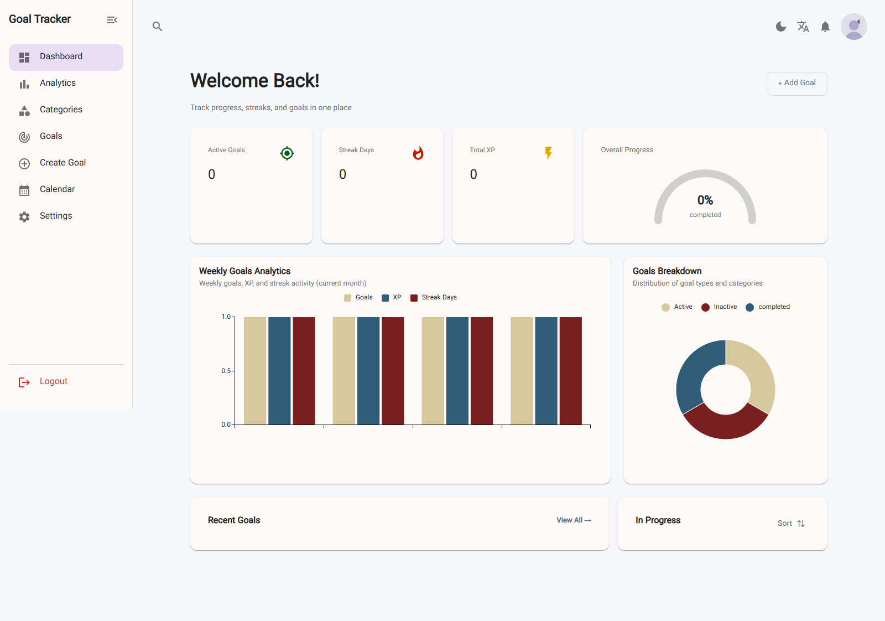
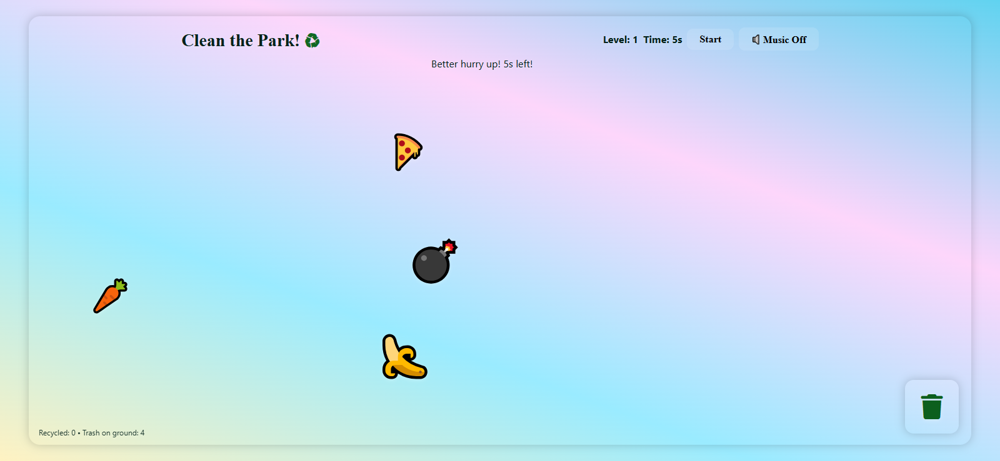
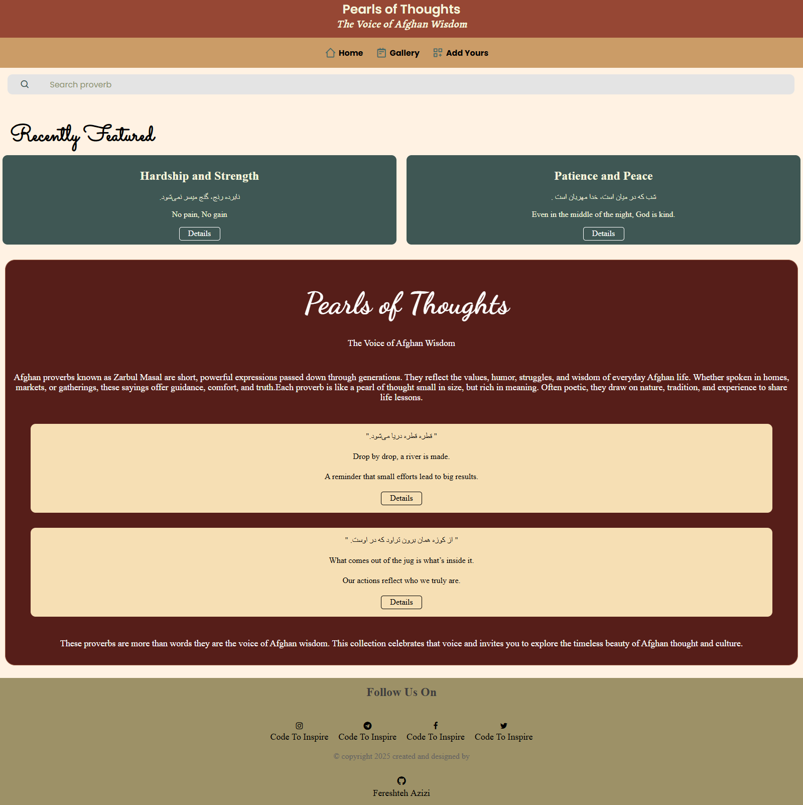

<div align="center">

# Ferra.

### Personal portfolio of Fereshteh Azizi

Front-end & full-stack web developer (React · Next.js · TypeScript) · Student at [Code To Inspire](https://www.codetoinspire.org/)

[](https://fereshtehazizi.github.io/My-Portfolio/)
[](https://github.com/fereshtehazizi)
[](https://www.linkedin.com/in/fereshteh-azizi-8584b5424)

A fast, fully responsive, data-driven portfolio — designed and built from scratch with **vanilla HTML, CSS, and JavaScript**. No frameworks, no build step, no page builders.

</div>

## ✨ Features

- **Projects gallery** — real web development work (a Next.js job portal, React dashboards, a browser game, and more), each with a live demo and its GitHub source.
- **Project detail pages** — every project opens into its own case-study page (`project.html?id=N`) with the stack, year, role, status, related work, and previous/next navigation.
- **Skills section** — an honest, categorized tech-stack overview instead of invented percentage bars.
- **Services & contact** — what I can build for a team, plus a working contact form.
- **Dark mode** — a light/dark theme toggle that persists across visits.
- **Zero dependencies** — no package manager, no build tools. Clone it and open it in a browser.

## 🔗 Live demo

**[fereshtehazizi.github.io/My-Portfolio](https://fereshtehazizi.github.io/My-Portfolio/)** — hosted for free on GitHub Pages.

## 🖼️ Selected work

| | | |
| :---: | :---: | :---: |
|  |  |  |
| *Goal Tracker — React dashboard* | *Clean the Park! — browser game* | *Pearls of Thoughts — web app* |

## 🧰 Tech stack

| Layer | Tools |
| --- | --- |
| Markup & styling | HTML5, modern CSS (Grid, custom properties, `color-mix()`) |
| Interactivity | Vanilla JavaScript (ES6+) |
| Typography | Playfair Display & DM Sans via Google Fonts |
| Icons | Font Awesome 6 |
| Hosting | GitHub Pages |

## 🚀 Getting started

No build step required:

```bash
git clone https://github.com/fereshtehazizi/My-Portfolio.git
cd My-Portfolio
```

Then open `index.html` in your browser — or serve it locally:

```bash
python -m http.server 8000     # Python
npx serve .                    # or Node
```

Visit `http://localhost:8000`.

## 📁 Project structure

```
My-Portfolio/
├── index.html           # Home — hero, about, services, portfolio grid, contact
├── project.html         # Project detail page (opens as project.html?id=N)
├── app.js               # Project data, rendering, theme toggle, contact form
├── portfoliostyle.css   # Main stylesheet (layout + light/dark themes)
├── color-1.css          # Finishing layer — radii, animations, hover polish
├── responsive-fix.css   # Legacy placeholder (drawer styles live in portfoliostyle.css)
├── projects/            # Project screenshots
├── pro31.jpg            # Portrait
└── favicon.png
```

## ➕ Adding a project

Everything is data-driven — projects render from a single array in `app.js`. Add one line and it automatically appears in the home grid, gets its own detail page, and joins the "more projects" gallery:

```js
// [image, title, category, description, live URL, GitHub URL, tech stack, year]
['project10.png', 'My New App', 'React app', 'Short description of the project.',
 'https://live-demo-url', 'https://github.com/username/repo', 'React, Tailwind CSS', '2026']
```

- Images without `http(s)` are loaded from the `projects/` folder.
- Leave the live URL empty (`''`) to show only the GitHub link.

## 🎨 Design

- Warm light theme with brown accents (`#a94719`), Playfair Display headings and DM Sans body text, plus a matching dark theme.
- Fully responsive, honors `prefers-reduced-motion`, and keyboard-friendly.

## 📬 Contact

- Email — [fereshtehazizi710@gmail.com](mailto:fereshtehazizi710@gmail.com)
- GitHub — [@fereshtehazizi](https://github.com/fereshtehazizi)
- LinkedIn — [fereshteh-azizi](https://www.linkedin.com/in/fereshteh-azizi-8584b5424)

---

© 2026 Fereshteh Azizi — designed and built with care, no templates.
